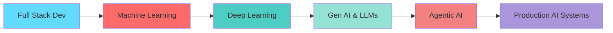

<div align="center">

# 👋 Hi, I'm Yug Dandawala

### 🚀 Software Engineer Intern | AI/ML Engineer | Gen AI Specialist

[](https://www.linkedin.com/in/yug-dandawala)
[](https://github.com/YugDandawala)
[](mailto:your.email@example.com)


</div>

---

## 🎯 About Me

```javascript
const yug = {
    currentRole: "Trainee Software Engineer Intern @ Netizens Technologies",
    education: "College Student | Lifelong Learner",
    focus: ["Deep Learning", "Generative AI", "Agentic AI", "Full Stack Development"],
    goals: "Building innovative AI-powered solutions that make a difference",
    passions: ["Machine Learning", "AI Agents", "Problem Solving", "Continuous Learning"],
    funFact: "I turn coffee into code and data into insights ☕️"
};
```

<div align="center">

### 🌱 Currently Learning
**Deep Learning** • **Neural Networks** • **LLM Fine-tuning** • **Multi-Agent Systems**

### 🎯 2025 Goals
Building production-ready AI applications • Contributing to open-source • Mastering advanced ML architectures

</div>

---

## 💻 Tech Stack

### 🤖 AI/ML & Data Science

<div align="center">


</div>

**Core Competencies:**
- **Machine Learning:** Supervised & Unsupervised Learning, Feature Engineering, Model Optimization
- **Deep Learning:** Neural Networks, CNNs, RNNs, Transfer Learning
- **Model Tuning:** Optuna, Hyperparameter Optimization, Cross-validation
- **Data Analysis:** EDA, Statistical Analysis, Data Visualization

### 🧠 Generative AI & LLMs

<div align="center">


</div>

**Expertise:**
- **LangChain Framework** - Building LLM-powered applications
- **RAG Systems** - Retrieval Augmented Generation pipelines
- **Vector Databases** - Efficient semantic search and embeddings
- **LangGraph** - Complex agent workflows and state management
- **MCP (Model Context Protocol)** - Standardized AI integration
- **A2A Protocol** - Agent-to-Agent communication
- **Tool Calling & Function Calling** - Dynamic LLM interactions
- **Multi-Agent Systems** - Collaborative AI architectures

### 🌐 Full Stack Development

<div align="center">

#### Frontend


#### Backend


#### Databases


</div>

**Additional Skills:**
- **ERP Systems:** ERPNext, Frappe Framework
- **API Development:** RESTful APIs, GraphQL
- **Version Control:** Git, GitHub
- **Responsive Design:** Mobile-first approach, Cross-browser compatibility

### 🛠️ Languages & Tools

<div align="center">


</div>

---

## 🚀 What I'm Working On

```python
current_projects = {
    "learning": [
        "Advanced Deep Learning architectures",
        "LLM fine-tuning and prompt engineering",
        "Building production-grade AI agents",
        "Scaling RAG systems"
    ],
    "building": [
        "Multi-agent AI systems",
        "Intelligent chatbots with memory",
        "Full-stack applications with AI integration",
        "Data science portfolio projects"
    ],
    "exploring": [
        "Computer Vision applications",
        "Natural Language Processing",
        "MLOps and model deployment",
        "Cloud-based AI solutions"
    ]
}
```

---

## 📊 GitHub Analytics

<div align="center">
  
  
  

</div>

<div align="center">
  
  
  
</div>

---

## 🏆 GitHub Trophies

<div align="center">
  
  
  
</div>

---

## 💡 Featured Projects

<div align="center">

| Project | Description | Tech Stack |
|---------|-------------|------------|
| 🤖 **AI Agent System** | Multi-agent system with LangGraph and tool calling | LangChain, Python, FastAPI |
| 📚 **RAG Chatbot** | Document Q&A with semantic search | LangChain, Pinecone, OpenAI |
| 📊 **ML Pipeline** | End-to-end ML workflow with deployment | Scikit-learn, Optuna, Streamlit |
| 🌐 **Full Stack App** | Modern web app with AI features | React, Node.js, MongoDB |

</div>

---

## 🎓 Learning Journey

<div align="center">



</div>

**Completed:** Full Stack Development, Machine Learning Fundamentals  
**Current:** Deep Learning, Generative AI, Agent Development  
**Next:** Advanced NLP, Computer Vision, MLOps  

---

## 📫 Let's Connect!

<div align="center">

I'm always open to interesting conversations and collaboration opportunities!

**Interested in:** AI/ML Projects • Open Source Contributions • Tech Discussions • Mentorship

[](https://www.linkedin.com/in/yug-dandawala)
[](mailto:your.email@example.com)

### 💬 Ask me about
**Python** • **Machine Learning** • **LangChain** • **React** • **Gen AI** • **RAG Systems** • **Frappe/ERPNext**

---


</div>

---

<div align="center">
  
  **⭐️ From [YugDandawala](https://github.com/YugDandawala)**
  
  *"Building the future, one line of code at a time"*
  
</div>
